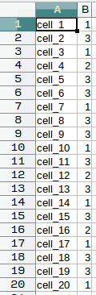
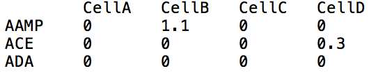
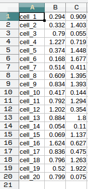

Input formatting
-----------------

Before you use COMET with gene expression data, your data should be
formatted into 3 files as shown below. The tables below are shown in excel format 
for ease of view, but files should be given as plain text files.

* ``markers.txt``: The expression matrix table stored as a TXT file (.txt). The columns
  of the table lists cell names, while the rows
  lists genes. The cell at the very top left should be
  blank. Each element in the rest of the table should contain a
  numerical gene expression value, corresponding to the row/cell and
  column/gene of the element. Tab delimited only. COMET does not do any preprocessing on 
  this file.
 
  
* ``tsne.txt``: The t-SNE data stored as a TXT file (.txt). Consists of three columns separated by tabs, 
  the first column is cell name (the same as those in
  ``markers.txt``), the second is the t-SNE_1 value for the cell, and
  the third is the t-SNE_2 value for the cell. Tab delimited only. 
**THIS DOES NOT HAVE TO BE TSNE. Any 2-d visualization is fine (e.g. UMAP)**
  
  |tsne|
  
* ``cluster.txt``: The cluster assignments for cells stored as a TXT file (.txt).
  The first column is cell name (consistent with
  ``markers.txt`` and ``tsne.txt``) and the second is the cluster of
  which the cell is a member. Cell names should avoid using punctuation marks. Tab delimited only.
  Please note: If you input clusters that start counting at zero, COMET will change the 0th cluster to the next highest
  from the max to avoid some computational problems. E.G. -> Clusters 0,1,2,3 turn to Clusters 1,2,3,4 where 0 is now 4.
  Values have not been shifted, the 0 has simply been renamed to 4 while 1, 2, and 3 all stay the same.
  
  |cluster|
  

* ``gene_list``: A list of genes to use for filtering in your
  data. An optional addition, but when used COMET will only consider the genes submitted here.
  By default COMET will use our own list of surface marking genes. Can be comma delimited on a single line or one gene per line, no commas.

.. toctree::
                                                                  
